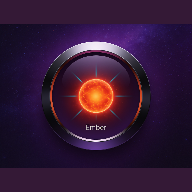

# 🏃‍♂️ Fitness Journey PWA

<div align="center">
  
</div>

<br />

**Fitness Journey** is a modern Progressive Web Application (PWA) designed for tracking physical activities, achieving fitness goals, and maintaining a healthy lifestyle through gamification. The app works completely offline, utilizes local device storage (IndexedDB), and features a sleek, neon-inspired UI optimized for both iOS and Android devices.

🔗 **Demo:** [Open App](https://prado8822.github.io/fitness-journey/) 

---

## 📑 Table of Contents
- [📸 Screenshots](#-screenshots)
- [🔒 Privacy First](#-privacy-first)
- [✨ Key Features](#-key-features)
- [🏗 Tech Stack](#-tech-stack)
- [🚀 Installation and Setup](#-installation-and-setup)
- [📦 Build and Deploy](#-build-and-deploy)
- [📱 How to Install on Phone (PWA)](#-how-to-install-on-phone-pwa)
- [📂 Project Structure](#-project-structure)
- [📄 License](#-license)

---

## 📸 Screenshots

<table align="center">
  <tr>
    <td align="center"><b>Home / Daily Goals</b></td>
    <td align="center"><b>Live GPS Tracker</b></td>
    <td align="center"><b>Analytics & Heatmaps</b></td>
  </tr>
  <tr>
    <td></td>
    <td></td>
    <td></td>
  </tr>
  <tr>
    <td align="center"><b>Manual Activity Log</b></td>
    <td align="center"><b>Trophies & Gamification</b></td>
    <td align="center"><b>Settings & Export</b></td>
  </tr>
  <tr>
    <td></td>
    <td></td>
    <td></td>
  </tr>
</table>

> *Responsive design: The UI automatically adapts to a sidebar layout on desktop devices, but shines brightest as a mobile PWA.*

---

## 🔒 Privacy First
This application is **100% Client-Side**.
* **No Servers:** All workout data, personal parameters, and settings are stored securely and locally on your device using IndexedDB (`localforage`).
* **No Tracking:** No external analytics, no cookies, no user tracking. Your fitness data is yours alone.
* **Data Portability:** Built-in JSON Export/Import functionality allows you to backup and restore your data at any time.

---

## ✨ Key Features

### 🛠 Core Functionality
* **Offline Mode:** Fully functional without internet access (PWA + Service Workers).
* **Live GPS Tracking:** Record your runs, walks, or cycling sessions on an interactive map with real-time distance and speed calculations.
* **Manual Entry:** Log over 10 different types of activities (Gym, Yoga, Swimming, etc.) with custom duration, intensity, and mood tracking.
* **Gamification & Ranks:** Earn XP, level up, maintain activity streaks, and unlock dozens of unique badges and limited-time "Golden Trophies".
* **Female Health Integration:** Optional menstrual cycle tracking that dynamically adjusts daily workout goals, providing phase-specific training and nutrition advice.
* **Advanced Analytics:** Visualize your progress with bar charts, pie charts of activity types, 28-day heatmaps, and personal records.
* **Multi-Language (i18n):** Fully translated into English, Polish, and Ukrainian.

### 🎨 UI/UX (Interface)
* **Mobile-First Design:** Looks and behaves exactly like a native app (Bottom Navigation, immersive modals, gesture-based interactions).
* **Epic Animations:** Smooth page transitions, particle explosions for streaks, dynamic gradient rings, and animated trophy unlocks.
* **Dark Theme:** Beautiful deep purple and neon styling styled entirely with Tailwind CSS.

---

## 🏗 Tech Stack

* **Core:** React 18+, Vite
* **Styling:** Tailwind CSS
* **Database:** IndexedDB (via `localforage`)
* **PWA:** `vite-plugin-pwa` (Manifest, Service Workers, Offline capabilities)
* **Maps & GPS:** `react-leaflet`, `leaflet`
* **Charts:** `recharts`
* **Image Generation:** `html-to-image` (for sharing achievements)
* **Routing:** `react-router-dom`
* **Icons:** `lucide-react`

---

## 🚀 Installation and Setup

To run the project locally, you will need Node.js installed.

1. **Clone the repository:**
   ```bash
   git clone https://github.com/Prado8822/fitness-journey.git
   cd fitness-journey
   ```

2. **Install dependencies:**
   ```bash
   npm install
   ```

3. **Start the development server:**
   ```bash
   npm run dev
   ```

*The application will be available at `http://localhost:5173`.*

---

## 📦 Build and Deploy

The project is configured for static deployment (perfect for GitHub Pages).

**Build the project:**
```bash
npm run build
```

**Deploy (automated script)::**
```bash
npm run deploy
```

*This command will build the project and push the `dist` folder to the `gh-pages` branch.*

---

## 📱 How to Install on Phone (PWA)

The app does not require downloading from the App Store or Google Play.

**🍏 iOS (iPhone/iPad)**
1. Open the [Demo Link](https://prado8822.github.io/fitness-journey/) in **Safari**.
2. Tap the **"Share"** button (square with an upward arrow at the bottom).
3. Select **"Add to Home Screen"**.
4. The app will now work like a native application (without the browser address bar).

**🤖 Android**
1. Open the [Demo Link](https://prado8822.github.io/fitness-journey/) in **Chrome**.
2. Tap the menu (three dots) or wait for the pop-up banner.
3. Select **"Install App"** or **"Add to Home screen"**.

---

## 📂 Project Structure

<details>
<summary><b>Click to view file structure</b></summary>

```text
fitness-journey/
├── public/                  # Static assets (not processed by the bundler)
│   ├── icon-192.png         # PWA icon for mobile devices (192x192)
│   └── icon-512.png         # High-resolution PWA icon (512x512)
│
├── src/                     # Main application source code
│   ├── components/          # Reusable UI components
│   │   ├── BadgeSystem.jsx  # Achievements system, badges, and reward modals
│   │   ├── CalendarView.jsx # Interactive calendar component
│   │   ├── GoalTracker.jsx  # Animated progress rings (similar to Apple Fitness)
│   │   ├── Stats.jsx        # Component for rendering charts (Recharts)
│   │   └── Tracker.jsx      # GPS tracker with an interactive map (Leaflet)
│   │
│   ├── pages/               # Main application screens (routes)
│   │   ├── AddActivity.jsx  # Add workout screen (GPS and "Manual entry" tabs)
│   │   ├── GoalsPage.jsx    # "Goals" screen: gamification, ranks, dynamic challenges
│   │   ├── Home.jsx         # Main screen (dashboard): mini-calendar, cycle tracker, streak
│   │   └── StatsPage.jsx    # "Statistics" screen: analytics, heatmap, personal records
│   │
│   ├── App.jsx              # Main component (routing setup, bottom navigation, settings menu)
│   ├── i18n.js              # Configuration for multi-language support (translations)
│   ├── index.css            # Global styles and custom CSS animations (Tailwind)
│   └── main.jsx             # React application entry point
│
├── .gitignore               # List of files and folders ignored by Git (e.g., node_modules)
├── index.html               # Main HTML file where React is mounted and manifest is linked
├── package.json             # Project dependencies (libraries) and scripts (dev, build)
├── package-lock.json        # Exact version lock for dependencies
├── postcss.config.js        # PostCSS configuration (required for Tailwind CSS)
├── tailwind.config.js       # Tailwind CSS settings (custom colors, fonts, themes)
└── vite.config.js           # Vite bundler configuration (including PWA plugin settings)
```
</details>

---

## 📄 License

This project is licensed under the GPLv3 License.

---
